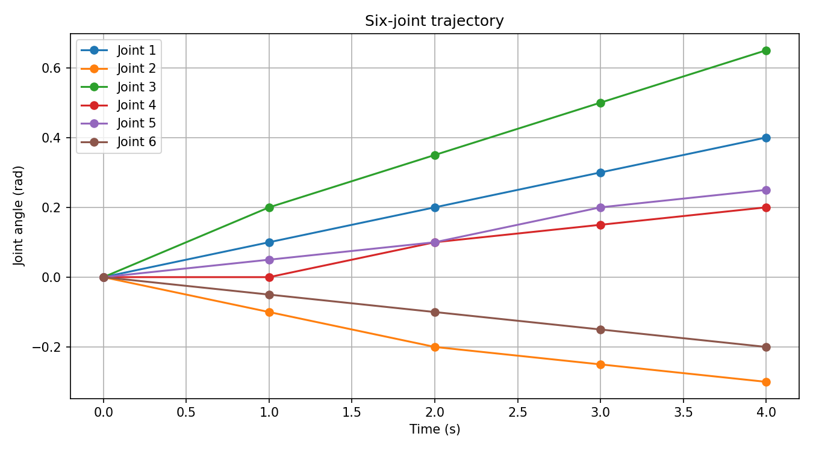
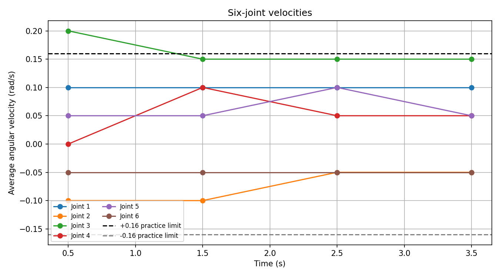

# Robotics Foundation · 从六关节轨迹走向机器人软件

> 一份持续更新的机器人软件学习记录：从 Linux、C++ 和 Eigen 出发，用可运行的小工程逐步走向 ROS 2、MoveIt 2、仿真与真机。

**当前进度：基础工程与六关节轨迹分析已完成；ROS 2 及后续阶段在计划中。**



## 现在能看到什么

- **C++ 工程化**：将 `TrajectoryAnalyzer` 拆成头文件、实现文件和主程序，用 CMake 构建静态库与可执行程序。
- **Eigen 坐标变换**：从二维旋转走到三维位姿、逆变换与“底座 → 末端 → 工具”的变换组合。
- **六关节轨迹数据**：C++ 生成五个时刻的示例 CSV；Python 读取并整理为 `5 × 6` 的 NumPy 数组。
- **轨迹分析与可视化**：绘制关节角度和四段平均角速度，导出速度 CSV，并用练习阈值标出超限区间。

| 结果 | 示例 |
| --- | --- |
| 六关节角度曲线 | [查看图片](trajectory_project/plots/all_joints.png) |
| 六关节平均角速度 | [查看图片](trajectory_project/plots/all_joint_velocities.png) |
| 速度阈值标记 | [查看图片](trajectory_project/plots/velocity_limit_check.png) |
| 示例数据 | [轨迹 CSV](trajectory_project/joint_trajectory.csv) · [速度 CSV](trajectory_project/joint_velocity.csv) |



> 数据为手工构造的学习样例；`0.16 rad/s` 是演示比较流程的练习阈值，不代表任何真实机械臂的速度限制。图中的速度是相邻采样点之间的**平均角速度**。

## 学习路线

| 阶段 | 状态 | 已有成果或下一目标 |
| --- | --- | --- |
| Linux 与 Git | ✅ 已学习 | WSL/Ubuntu 环境、命令行、权限与路径、提交和远程同步 |
| C++ 与 STL | ✅ 已学习 | 引用、指针、`const`、生命周期；`vector`、`map`、算法、Lambda、智能指针 |
| CMake 与 Eigen | ✅ 已实践 | 多文件静态库、可重复构建、二维/三维坐标变换与位姿组合 |
| Python 轨迹分析 | ✅ 已实践 | CSV、NumPy、Matplotlib、角度与平均角速度图、阈值检查 |
| ROS 2 | ⏳ 下一阶段 | C++ 节点、Topic、Service、Action、Parameter、TF2 与 rosbag2 |
| MoveIt 2 | 📌 计划中 | 机械臂运动规划与轨迹执行接口 |
| 仿真 | 📌 计划中 | 在仿真中验证规划、控制与状态反馈 |
| 真机 | 📌 计划中 | 在基础与仿真验证之后连接真实机械臂 |

这条路线来自项目中的阶段性学习讨论。后四项是**计划**，仓库目前没有把它们写成已经实现的功能。[完整学习复盘](docs/learning-journey.md)

## 仓库导航

```text
robotics-foundation-sep/
├── c++/                  # C++ 核心与 STL 的逐步练习
├── trajectory_project/   # CMake + Eigen + CSV + NumPy + Matplotlib
├── docs/                 # 学习复盘与真实踩坑记录
└── scripts/              # 环境检查脚本
```

- [C++ 练习索引](c++/README.md)
- [轨迹项目与结果说明](trajectory_project/README.md)
- [从基础到真机的学习复盘](docs/learning-journey.md)
- [环境与工具学习记录](docs/2026-09-15-environment-setup.md)
- [踩坑与收获](docs/troubleshooting.md)

## 简短运行方式

在 Ubuntu 22.04 / WSL 中安装 C++ 编译器、CMake、Eigen 3 与 Python 3 后，进入 `trajectory_project`：

```bash
cmake -S . -B build
cmake --build build
./build/trajectory_app
./build/eigen_demo
./build/export_trajectory
python3 -m venv .venv
source .venv/bin/activate
python -m pip install -r requirements.txt
mkdir -p plots
python scripts/plot_trajectory.py
```

这些命令只是复现入口；仓库重点记录**学过什么、做出了什么、还有什么尚未完成**。

如果你也在从 C++ 基础走向机器人软件，欢迎 Star 关注后续 ROS 2、MoveIt 2 和仿真阶段。反馈或交流可以在 Issues 中提出。
